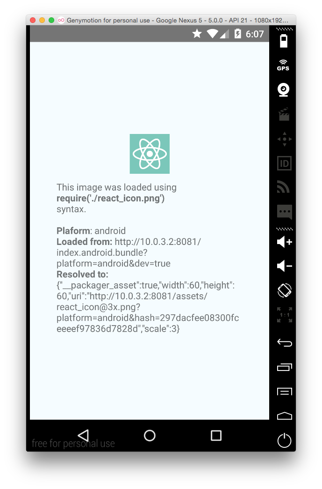
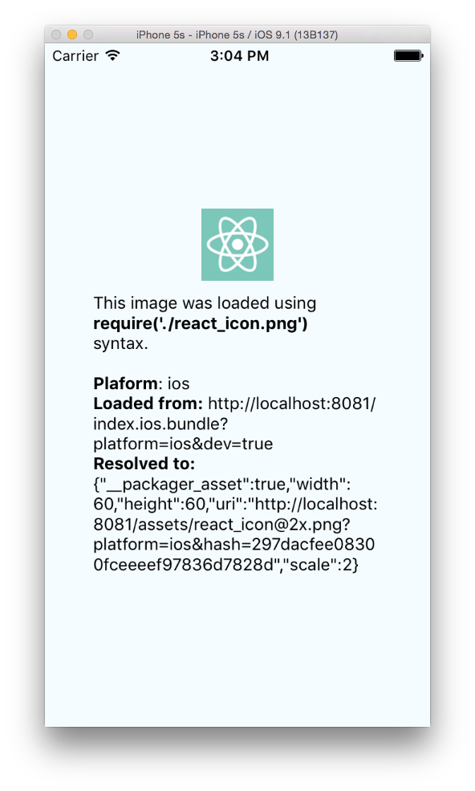

# React Native Assets Example

This is a small demo of upcoming asset management system in React Native v0.14.

## API

To use a static image in your app, place it somewhere next to your JS files
and use relative require syntax:

```javascript
<Image source={require('./react_icon.png')} />
```

Reload the app. Done! If `@2x`, `@3x` or `@4x` images available, packager will
use the image that corresponds to device's pixel density.

## Demo




## Running the examples

```sh
git clone git@github.com:frantic/ReactNativeAssetsExample.git
cd ReactNativeAssetsExample/
npm install
```

